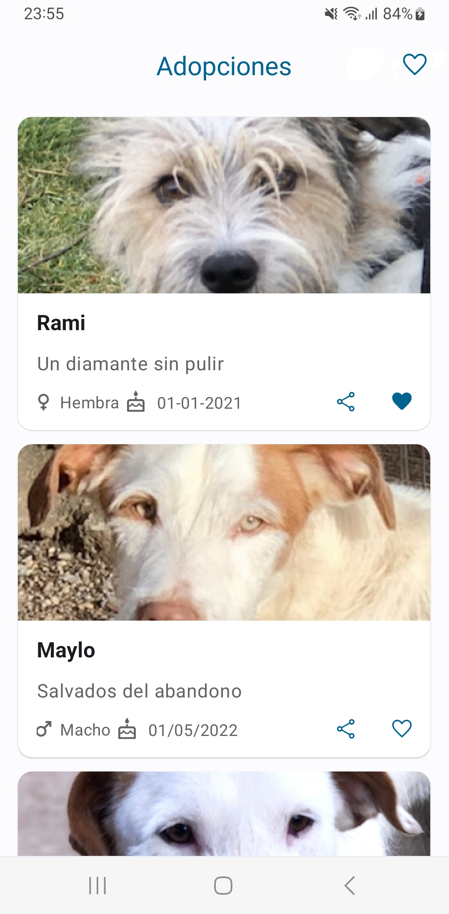
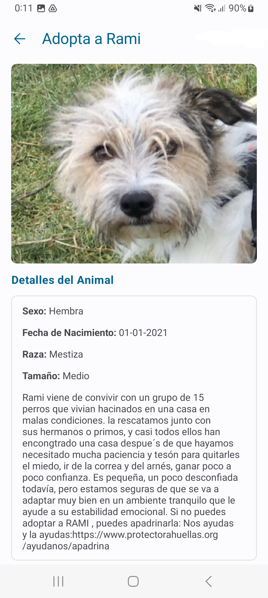

## Examen Programación Multimedia y Dispositivos Móviles 22-23 (Marzo)

## Aviso Importante

Tal como se indica en la programación didáctica del módulo, para aprobar se necesita superar todos
los objetivos.

Los objetivos están agrupados en:

1. [Aplicaciones Móviles](https://iesam-dam.github.io/programacion-multimedia-dispositivos-moviles/evaluation/ra-apps.html)
   .
2. [Android Studio](https://iesam-dam.github.io/programacion-multimedia-dispositivos-moviles/evaluation/ra-androidstudio.html)
   .
3. [Arquitectura](https://iesam-dam.github.io/programacion-multimedia-dispositivos-moviles/evaluation/ra-arquitectura.html)
   .
4. [User Interface(UI)](https://iesam-dam.github.io/programacion-multimedia-dispositivos-moviles/evaluation/ra-ui.html)
   .
5. [Multimedia](https://iesam-dam.github.io/programacion-multimedia-dispositivos-moviles/evaluation/ra-multimedia.html)
   .
6. [Publicación App](https://iesam-dam.github.io/programacion-multimedia-dispositivos-moviles/evaluation/ra-publicacion.html)
7. [Calidad del código](https://iesam-dam.github.io/programacion-multimedia-dispositivos-moviles/evaluation/ra-extras.html)

Si en la prueba existiera algo que no se haya visto en clase o esté fuera de los objetivos no será
calificado y lo dará el profesor.

## Requisitos para la realización de la prueba

- La prueba tiene una duración de 4 horas. Una vez terminada la prueba, se quitarán los privilegios
  al usuario para evitar modificaciones.
- La prueba se hará sobre el
  repositorio: [Prueba PMDM Curso 22/23 Marzo](https://github.com/IESAM-DAM/ex_22_23_pmdm_marzo.git)
- La prueba se entrega a través de una Pull Request por cada uno de los ejercicios solicitados. Si
  no se entrega una Pull Request se considerará incompleta pues existe un objetivo sobre la
  documentación a través de Pull Request.
- En la Pull Request pondrá como revisor al profesor.
- **No se hará nada de la capa de datos** todo lo necesario de esta capa está ya en el proyecto.
- Los recursos necesarios: iconos, imágenes, etc. lo dará el profesor.
- Se deberá seguir una arquitectura Clean Architecture: presentation, domain y data.
- Se podrán crear todas las funciones de extensión o complementarias que ayuden en la mejora y
  calidad del código.

Si se incumple algunos de los requisitos descritos la prueba se considerará como **No entregada**.

## Contexto de  los ejercicios

Se pide realizar una aplicación que muestre un listado de adopciones. Además, el usuario podrá
obtener más información por cada una de las adopciones y realizar algunas otras acciones: compartir.

## Ejercicio 1: Estructura de la aplicación

Se pide crear la estructura de la aplicación:

1. Añadir las librerías que se crean oportunas.
2. La aplicación tendrá una actividad principal y dos fragmentos. Esta actividad tendrá el
   FragmentContainer donde se cargarán los fragmentos.
3. El fragmento a cargar por defecto es el de Listado de adopciones. Esto se establecerá con el
   componente de Navegación.
4. El fragmento AdoptionsFragment se encargará de mostrar el listado de adopciones.
5. El fragmento AdoptionDetailFragment mostrará el detalle de la adopción.

## Ejercicio 2: Listado de Adopciones (AdoptionsFragment)

Se pide crear la pantalla que muestra el listado de adopciones:

1. Crear los items usando un componente eficiente sabiendo que no se conocen el número de adopciones
   existentes.
2. El diseño será el que se adjunta. La vista debe ser construida de forma eficiente.
3. Deberá existir una toolbar.
4. Al hacer click en una de las adopciones, se mostrará el detalle de la adopción seleccionada.
5. Se deberá añadir una animación entre la navegación del listado de adopciones y el detalle.
6. Al pulsar sobre el icono de corazón de la Toolbar, se mostrará un SnackBar con el texto: Favorito
   seleccionado.
7. Al pulsar sobre el icono de compartir que se muestra en cada uno de los items de adopciones,
   mostrará un SnackBar con el texto: compartir.
8. Es necesario el uso de dimens, strings y estilos.
9. La comunicación con los casos de uso se hará mediante el patrón MVVM.
10. La comunicación entre el ViewModel y la vista se hará mediente LiveData.
11. Los casos de uso se ejecutarán con Coroutines (lo da el profesor).
12. La imagen de las adopciones se cargará por URL.
13. Se deberán gestionar los tres estados de la vista: loading, error y datos.
14. Cuando la vista está en el estado loading, se mostrará un SnackBar con el texto: Cargando....
15. Cuando la vista está en el estado error, se mostrará un SnackBar con el texto: Error!!
16. Se deberé usar Hilt como Inyector de Dependencias.

**Diseño**


## Ejercicio 3: Detalle de Adopciones

Se pide crear la pantalla que muestra el detalle de adopciones.

1. La vista tendrá en cuenta cualquier tipo de resolución del móvil.
2. El diseño será el que se adjunta. La vista debe ser construida de forma eficiente.
3. Al pulsar sobre la flecha de la toolbar volveremos al listado de adopciones.
4. En el listado de adopciones al pulsar en el botón 'atrás' saldremos de la aplicación.
5. Deberá existir una toolbar.
6. Es necesario el uso de dimens, strings y estilos.
7. La comunicación con los casos de uso se hará mediante el patrón MVVM.
8. La comunicación entre el ViewModel y la vista se hará mediente LiveData.
9. Los casos de uso se ejecutarán con Coroutines (lo da el profesor).
10. La imagen de las adopciones se cargará por URL.
11. Se deberán gestionar los tres estados de la vista: loading, error y datos.
12. Cuando la vista está en el estado loading, se mostrará un SnackBar con el texto: Cargando....
13. Cuando la vista está en el estado error, se mostrará un SnackBar con el texto: Error!!
14. El uso de Hilt es opcional.

**Diseño**


## Ejercicio 4: Publicación de la app

Se pide publicar el proyecto en el Play Store.

1. Generaremos una versión firmada del bundle (aar).
2. Crearemos una rama release del proyecto.
3. Crearemos un tag de la rama release. Añadiremos el bundle al tag (aar).

## Código de prueba

**Ejecución de una Coroutine en el ViewModel**

```
viewModelScope.launch{
   // Código aquí
}
```